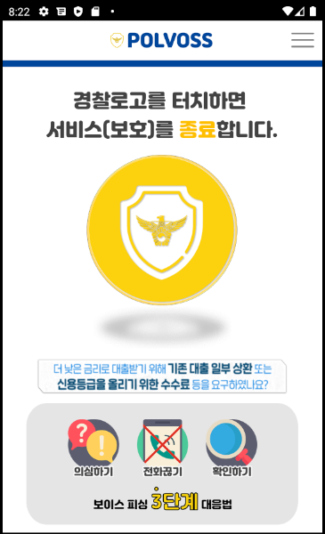
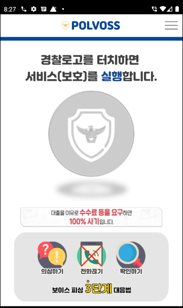
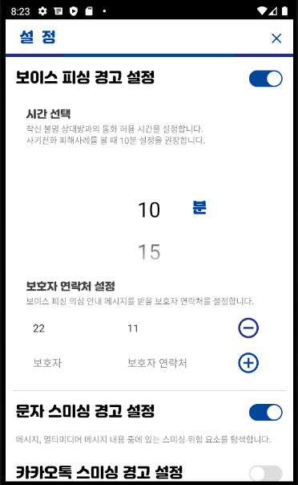
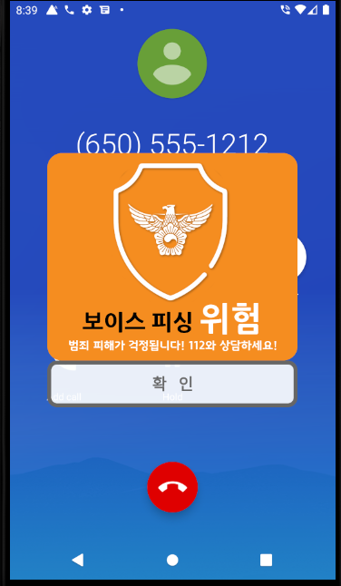
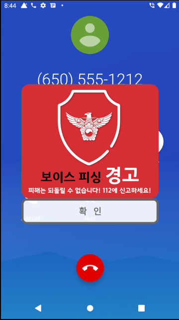

# 폴보스 피싱예방

## Introduction
폴보스 피싱예방은 보이스피싱, 스미싱을 예방하는 안드로이드 프로젝트입니다.  
[폴보스 피싱예방 원스토어 다운로드](https://m.onestore.co.kr/mobilepoc/apps/appsDetail.omp?prodId=0000751975)

## Features
1. 저장되지 않은 번호와 통화 시 보이스피싱 위험 알림
2. 보이스피싱 위험 알림 시 보호자에게 자동 연락
3. 수신하는 메시지에서 스미싱 위험 알림
4. 수신하는 카카오톡 메시지에서 스미싱 위험 알림
5. 통화 후 보이스피싱 위험 알림 시간 설정
6. 보호자 연락처 선택 

## Application Version
- minSdkVersion: 21
- targetSdkVersion: 29

## Library
- [AutoPermissions](https://github.com/pedroSG94/AutoPermissions)

## Screenshots
  
  

## Release
- 2020.12.01 - 원스토어 출시
- 2020.12.09 - 신뢰할 수 있는 사이트 추가
- 2020.12.11 - 신뢰할 수 있는 연락처 추가

